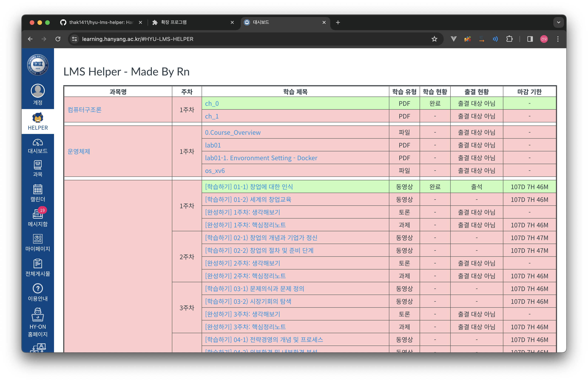

# Hanyang University LMS Helper

## 소개

[한양대학교 LMS](https://learning.hanyang.ac.kr/) 출석 현황을 보기 쉽게 만들어주는 크롬 익스텐션입니다.

* 개인정보를 수집하지 않습니다.
* MIT라이센스로 배포됩니다.
* 사용시 발생하는 모든 문제의 책임은 실행한 사람에게 있습니다.

## 사용 방법

### 수동 설치

~~~
git clone https://github.com/thak1411/hyu-lms-helper.git

혹은

zip 파일 내려받기 후 압축해제
~~~

* Chrome: 내려받은 폴더를 그대로 [크롬 익스텐션 등록](https://developer.chrome.com/extensions/getstarted)하면 됩니다.
* Firefox / Zen: [디버깅 페이지](about:debugging)로 접속하고 "This Firefox(or This Zen)" -> "Load Temporary Add-on"을 누른 후 내려받은 zip파일 (혹은 압축 해제된 파일의 manifest.json)을 선택하면 됩니다.

### 스토어에서 설치

* Chrome: [크롬 웹스토어](https://chrome.google.com/webstore/detail/hyu-lms-helper/ahkbicmdpaknajbgefiolmhakkkojaml?hl=ko&)에서 크롬에 추가
* Firefox / Zen은 아직 스토어를 통한 설치를 제공하지 않습니다.

### 설치 이후

사이트 접속시 대시보드, 과목 등이 뜨는 메뉴 바에 HELPER라는 메뉴가 생성되는데 이 메뉴를 눌러 사용가능합니다.

## History

### v1.5.0

* 컨텐츠 파일을 다운로드 받을 수 있도록 변경
* manifest v3로 변경

### v1.4.0

* 2024년 이후 API Spec 변경으로 인해 작동하지 않던 문제 해결
* 표 디자인 일부 수정
* 과목 명 클릭 시 해당 과목으로 이동하는 기능 추가
* 메뉴 위치 변경
* 모바일 버전 메뉴 바에서 HELPER 버튼이 보이지 않던 이슈 수정

### v1.3.0

* 표 디자인 개선 - 글자 수 제한 및 툴팁 생성으로 표가 깨지는 것을 방지
* 하이리온으로 메뉴 바의 아이콘 변경
* 표가 이상하게 색칠되던 버그 수정

### v1.2.0

* 표에서 셀 병합시 생기는 버그 수정
* 강의명에 하이퍼링크 기능추가
* 출결 현황 메시지 업데이트
* 마감 기한이 UTC +0 으로 뜨던 문제 해결 및 남은 시간으로 표시하도록 수정

### v1.1.0

* 토큰을 받아오지 못하던 문제 해결
* 테이블 그릴 때 데이터 로딩이 되지 않으면 아무것도 그려지지 않던 문제 해결

### v1.0.0

* 첫 번째 버전 릴리즈
