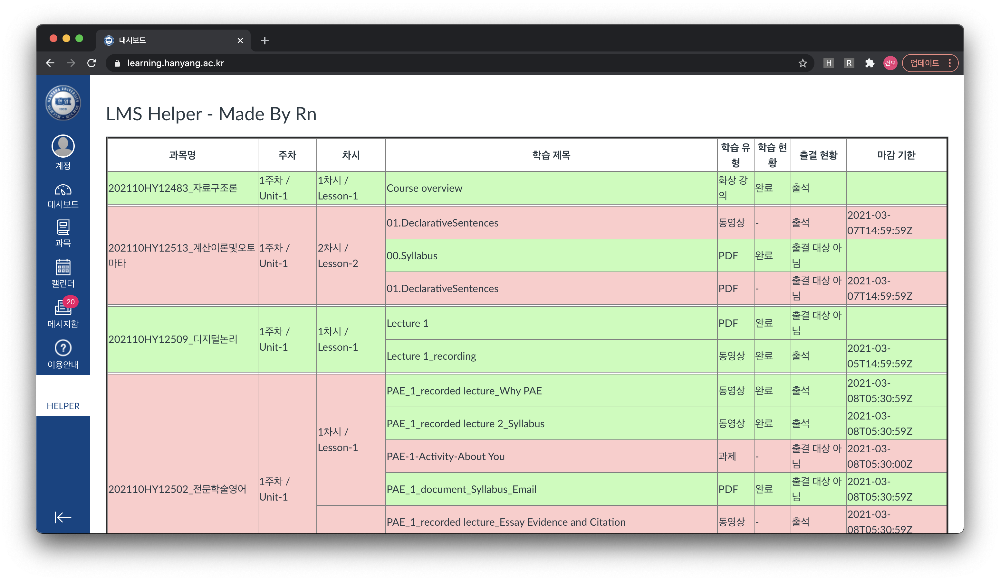

# Hanyang University LMS Helper

## 소개

[한양대학교 LMS](https://learning.hanyang.ac.kr/) 출석 현황을 보기 쉽게 만들어주는 크롬 익스텐션입니다.

* 개인정보를 수집하지 않습니다.
* MIT라이센스로 배포됩니다.
* 사용시 발생하는 모든 문제의 책임은 실행한 사람에게 있습니다.

## 사용 방법

~~~
git clone https://github.com/thak1411/hyu-lms-helper.git

혹은

zip 파일 내려받기 후 압축해제
~~~

내려받은 폴더를 그대로 [크롬 익스텐션 등록](https://developer.chrome.com/extensions/getstarted)하면 됩니다.

이후 사이트 접속시 HELPER라는 메뉴가 생성되는데 이 메뉴를 눌러 사용가능합니다.

## History

### v1.0.0

* 첫 번째 버전 릴리즈